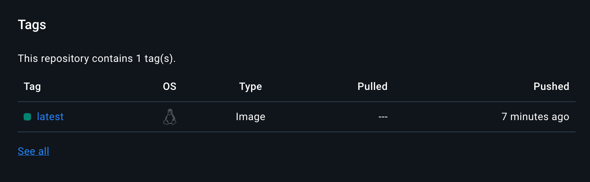

IS601 - Homework 8 

### Screenshot
1. Put the screenshot of your image in your Docker account here.

### Completed
1. Created a repository from scratch
2. Implemented necessary files
3. Successfully implemented Github Actions
4. Ran Pytest successfully
5. Added secret tokens from Docker to Github to connect them
6. Successful deployment of the repository on Github/Image is on Docker